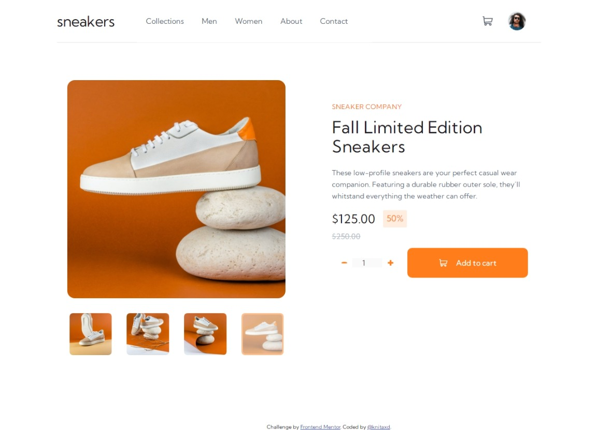

# Frontend Mentor - E-commerce product page solution

This is a solution to the [E-commerce product page challenge on Frontend Mentor](https://www.frontendmentor.io/challenges/ecommerce-product-page-UPsZ9MJp6). Frontend Mentor challenges help you improve your coding skills by building realistic projects.

## Table of contents

- [Overview](#overview)
  - [The challenge](#the-challenge)
  - [Screenshot](#screenshot)
  - [Links](#links)
- [My process](#my-process)
  - [Built with](#built-with)
  - [What I learned](#what-i-learned)
  - [Continued development](#continued-development)
  - [Useful resources](#useful-resources)
- [Author](#author)
- [Acknowledgments](#acknowledgments)

**Note: Delete this note and update the table of contents based on what sections you keep.**

## Overview

### The challenge

Users should be able to:

- View the optimal layout for the site depending on their device's screen size
- See hover states for all interactive elements on the page
- Open a lightbox gallery by clicking on the large product image
- Switch the large product image by clicking on the small thumbnail images
- Add items to the cart
- View the cart and remove items from it

### Screenshot

### Links

- Solution URL: 
- Live Site URL: 

## My process

Was my first time using the mobile-first workflow and i really love it. The challenge was so hard but finally i solved it, i had many questions and that help me a lot to learn new things. I know some things are not doing on the best way but this challenge doesn't finish here for me, my plan is to do better versions of this. 

### Built with

- Semantic HTML5 markup
- CSS custom properties
- Flexbox
- Mobile-first workflow
- Vanilla JavaScript

### What I learned

I take some recomendations on my last challenge, one of these recomendations was the use of semantic html, and a i did it, maybe is not the best, but i promise i'm going to do it better in the other versions and challenges.

Taking just couple of lines to talk about what i am proud is not fair because CSS and JavaScript are too hard, so the hole code (especially the cart functions) makes me feel so proud.

### Continued development

I want to improve the semantic html, furthermore i want to get use to add more grid to have facilites with the responsive web desing. About JavaScript i need to continue learning a lot on event listeners, POO and everything!

### Useful resources

- [W3 Schools](https://www.w3schools.com/howto/howto_js_sidenav.asp) - This helped me a lot to do the side/nav bar responsive.
- [W3 Schools](https://www.w3schools.com/howto/howto_js_slideshow.asp) - This helped me a lot to do the slideshow and the lightbox too.

- [Udemy - Juan de la Torre](https://www.udemy.com/course/javascript-moderno-guia-definitiva-construye-10-proyectos/learn/lecture/21852556?start=0#overview) - This course helped me with the cart functions.

## Author

- Frontend Mentor - [@knitaxd](https://www.frontendmentor.io/profile/knitaxd)
- Twitter - [@knitaxd](hhttps://twitter.com/knitaxd)
- GitHub - [@knitaxd](hhttps://github.com/knitaxd)

## Acknowledgments

I was helped a lot with the Juan de la Torre course to do the cart functions, them i use the W3 Schools page to learn about how to do some things like the slideshow. I would have liked to use more Grid in this project.